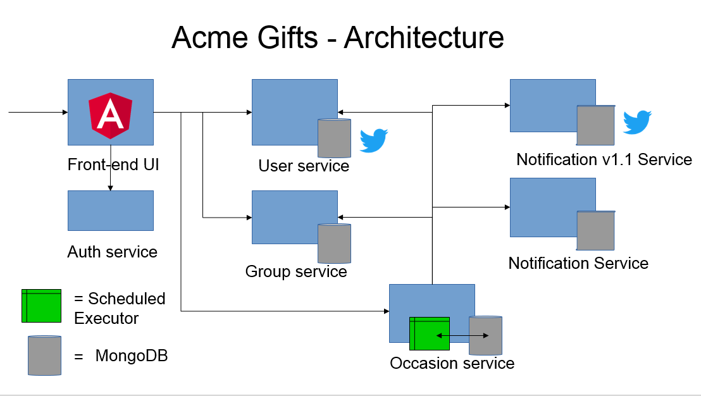

# Acme Gifts
A social gift giving application built on the [MicroProfile](http://microprofile.io/) platform

## Table of Contents

* [What is Acme Gifts?](#what-is-acme-gifts)
* [Getting Started](#getting-started)
* [Using the Application](#using-the-application)
* [Microservices](#microservices)
* [Configuration and Customization](#configuration-and-customization)
* [Using Acme Gifts](#using-acme-gifts)
* [Running Acme Gifts on Minikube](#running-acme-gifts-on-minikube)

## What is Acme Gifts?

Acme Gifts is a Java microservices application that was designed to run on Open Liberty and showcase MicroProfile. The front-end was written using Angular 2, and the back-end uses microservices written to the MicroProfile 1.2 specification. The MicroProfile services used include Config 1.1, Fault Tolerance 1.0, and JWT 1.0. Each service, as well as the front end, was designed to run in an independent Liberty server instance.

Acme Gifts provides a platform for users to create and join groups and exchange gifts within those groups. For example, a specific user may be a part of a co-workers group as well as a friends or family group. In each of these groups, occasions can be created (i.e. John's Birthday, Stacy's Retirement, etc.) to occur on a specific date. Users in that group can then pledge a contribution to that occasion, and when the occasion occurs, the recipient will be notified via Twitter of the total sum that their group raised for them. They are then informed to choose an item off of their predefined wish-list for the allotted sum. 

## Getting Started

### Prereqs 

* Maven - [Maven](https://maven.apache.org/download.cgi) v3.5.0 must be installed and set on the environment path. 

* Java 8 - Java 8 must be used to compile and run this project.

* MongoDB - [MongoDB](https://www.mongodb.com/) v3.4.6 must be installed and either set on the environment path or set using the <mongo.path> property in sample-acmegifts/pom.xml.

* Running in admin mode (Windows only) - Maven commands must be run in admin mode to ensure that the Mongo databases are successfully auto-started in the background

### Quick start
Build and start the full suite of microservices that make up the Acme Gifts application

    git clone https://github.com/OpenLiberty/sample-acmegifts.git
    cd sample-acmegifts
    mvn clean install
    mvn package -P start-databases,start-servers -pl run-app

Go to https://localhost:5064 if using the default host and ports. Otherwise, use the custom host and ports defined for the front-end-ui service.

## Using the Application

### Accepting Certificates

Acme Gifts is secured with self-signed certificates. The certificate is generated when the 
'shared-keystore' project is built, and copied into each of the other projects.
   
   **IMPORTANT** 
   After the microservices are started, the first time you use Acme Gifts, you will need to accept
   the self-signed certificate browser challenge.

   **FIREFOX NOTE**
   Firefox requires that certificate be accepted for each distinct hostname and port combination. 
   Consequently, you will need to go to each of the following URLs and accept the self signed 
   certificate challenges.

    Landing Page: https://localhost:5064/login  
    User microservice: https://localhost:5051/users  
    Group microservice: https://localhost:5054/groups  
    Occasion microservice: https://localhost:5057/occasions  
    Authorization microservice: https://localhost:5066/auth

   If you are using the default hosts and ports, you can use the links as shown. Otherwise, replace the
   host and ports for each of the links with your custom host and ports.

Note: The following error can be ignored while accepting certificates:

> HTTP Error 401 
Error: CWWKS5525E: An error was encountered while authenticating a user by using MicroProfile JSON Web Token (JWT).

### Navigating the UI

The user interface is composed of a four main portals: 

1. Landing/Login - Allows users to create an account, sign into their account, or sign in with Twitter. 
2. User - Displays information about the authenticated user including a list of groups that the user is a part of, and how much money he or she is pledging. 
3. Group - Displays information for a specific group including the members and occasions of that group.
4. Occasion - Displays information for a specific occasion including the date, recipient and organizer. 

The life-cycle of users, groups, and occasions (creating, editing, deleting) can be managed through these portals.

## Microservices

Acme Gifts has a microservice architecture. It is made up of several services that are deployed independently. Below are the details of each microservices. To build and start a specific service, complete any configuration steps and issue the Maven commands in the "Build and Start" section.

* [User Microservice](#user-microservice)
* [Group Microservice](#group-microservice)
* [Occasion Microservice](#occasion-microservice)
* [Notification Microservice](#notification-microservice)
* [Notification Microservice v1_1](#notification-microservice-v1_1)
* [Frontend-UI](#frontend-ui)
* [Auth Microservice](#auth-microservice)

### User Microservice:
The user microservice manages the lifecycle of users and user login within the Acme Gifts application. Users have the added ability to login using Twitter credentials.

#### Configuration:

* To allow users to login using Twitter, complete the [Twitter Configuration](#twitter-configuration)

#### Build and Start
Issue the following commands from within sample-acmegifts/microservice-user directory

    mvn clean package install
    mvn exec:exec@start-database
    mvn liberty:start-server
    
### Group Microservice:

The group microservice manages the lifecycle of groups within the Acme Gifts application. 

#### Build and Start
Issue the following commands from within sample-acmegifts/microservice-group directory

    mvn clean package install
    mvn exec:exec@start-database
    mvn liberty:start-server
    
### Occasion Microservice:

The occasion microservice manages the lifecycle and orchestration of occasions within the Acme Gifts application. 

#### Build and Start
Issue the following commands from within sample-acmegifts/microservice-occasion directory

    mvn clean package install
    mvn exec:exec@start-database
    mvn liberty:start-server
    
### Notification Microservice:

The notification microservice is a basic admin notification service that logs to a file when 
scheduled occasions take place.

#### Configuration:

* Optionally, update the location/name of the administrative log by updating the entry located under the
   "Optional Microservice Configuration" label in the "properties" section of the
   sample-acmegifts/microservice-notification pom.xml. The default value is: 
   
   `notification.log.file = ${project.build.directory}/logs/notifications.log`
   
#### Build and Start
Issue the following commands from within sample-acmegifts/microservice-notification directory

    mvn clean package install
    mvn liberty:start-server

### Notification Microservice v1_1:

The notification microservice v1_1 is a notification service that logs to a file for administrative purposes and sends twitter notifications to those users associated to the occasion. To receive twitter notifications, users must have a valid twitter handle in their user profile.

#### Configuration:

* To allow users to receive tweets, complete the [Twitter Configuration](#twitter-configuration) (This may have already been done when configuring the user microservice)

* Optionally, update the location/name of the administrative log and fallback log by updating the entry located under the
   "Optional Microservice Configuration" label in the "properties" section of the
   sample-acmegifts/microservice-notification_v1_1 pom.xml. The default values are: 
   
   `notification_1_1.log.file = ${project.build.directory}/logs/${project.build.directory}/logs/notifications_1_1.log`
   
   `notification_1_1.fallback.log.file = ${project.build.directory}/logs/notifications_1_1_fallback.log`   

#### Build and Start
Issue the following commands from within sample-acmegifts/microservice-notification_v1_1 directory

    mvn clean package install
    mvn liberty:start-server

### Frontend UI:

The Acme Gifts UI is written in Angular 2 and built using the frontend-maven-plugin. This plugin downloads and installs local versions of Node and NPM which makes calls to Angular CLI to install and build the source code. Compiled files are placed in src/main/webapp which Maven builds into a war to deploy in Liberty.

#### Build and Start
Issue the following commands from within sample-acmegifts/front-end-ui directory

    mvn clean package install
    mvn liberty:start-server
    
### Auth Microservice:

The auth microservice manages the creation and validation of JSON Web Tokens (JWTs) used to secure the Acme  Gifts application.

#### Build and Start
Issue the following commands from within AcmeGifts/microservice-auth directory

    mvn clean package install
    mvn liberty:start-server
    
## Configuration and Customization

### Twitter Configuration
Acme Gifts provides the ability for users to login using Twitter credentials as well as receive direct messages when occasions occur. Note that in order for occasion recipients to be notified of the occasion with a direct message, they must be following the twitter account being used on behalf of Acme Gifts.  

Follow the steps below to configure an existing twitter account for Acme Gifts.

1. Specify valid twitter generated keys/secrets/tokens. 
   These properties to update are located under the "Optional Microservice Configuration" label in the "properties" section of sample-acmegifts/pom.xml. Update the CHANGE_ME values with valid twitter generated keys/secrets/tokens.
   These values can be obtained from a valid twitter account application to be used on behalf of the Acme Gifts application. Steps for setting up and obtaining the needed values:
   
   a. Go to: https://apps.twitter.com/ to register the 'Acme Gifts' application under a 
    valid twitter account. This account will be used on behalf of the Gifts application.
    NOTE: Be sure to fill in the 'Callback URL' section when creating the application. 
    The entry can be a dummy URL. If the application exists already, go to the 'Settings' tab 
    and make sure something was specified in the 'Callback URL' section.

   b. Under the Details tab, modify the access level to 'Read, write, and direct messages'.

   c. Under the 'Key and Access Tokens' tab, generate access token/secret.

   d. Replace CHANGE_ME with the consumer key/secret and the access token/secret generated values.

   
### Host and Port Configuration
You can customize the ports and host names used by the microservices and their resources.
These values can be updated under the "Optional Microservice Configuration" label in the "properties" 
section of the Acme Gifts pom.xml. These are the defaults:

    - user.hostname = localhost
    - user.http.port = 5050  
    - user.https.port = 5051  
    - user.mongo.port = 5052  
    - user.mongo.hostname = localhost

    - group.hostname = localhost
    - group.http.port = 5053  
    - group.https.port = 5054  
    - group.mongo.port = 5055  
    - group.mongo.hostname = localhost

    - occasion.hostname = localhost
    - occasion.http.port = 5056  
    - occasion.https.port = 5057  
    - occasion.mongo.port = 5058  
    - occasion.mongo.hostname = localhost

    - notification.http.port = 5059  
    - notification.https.port = 5060  

    - notification_1_1.http.port = 5061  
    - notification_1_1.https.port = 5062  

    - frontend.http.port = 5063  
    - frontend.https.port = 5064  
    - frontend.hostname = localhost  

    - auth.http.port = 5065
    - auth.https.port = 5066
    - auth.hostname = localhost
  
### Bootstrapping Data 
The Acme Gifts application can be started with custom bootstrap data. Users, groups, and occasions can be preloaded for demo purposes. 
Checkout the run-app [readme](run-app/README.md) for usage details.

## Using Acme Gifts
For details on how to use Acme Gifts checkout [Using Acme Gifts](front-end-ui/README.md).

## Running Acme Gifts on Minikube
Acme Gifts can run on a minikube Kubernetes cluster.

### Pre-reqs
1. Minikube.
1. Kubectl.
1. Docker.
1. Virtual Machine driver (i.e. VirtualBox).

### Usage:
The following instructions show how to run pre-built images of the application from Docker Hub. These images do not contain the 
custom information required to perform actions such as logging-in with twitter or using the twitter notification support 
provided by `notification microservice v1_1`. If you wish to perform twitter related action, you will need to build your own images
using the provided `docker-build` script. Before executing the script, update the following entries:
  - -Dtwitter.app.consumer.key=CHANGE_ME \
  - -Dtwitter.app.consumer.secret=CHANGE_ME \
  - -Dtwitter.user.access.token=CHANGE_ME \
  - -Dtwitter.user.access.secret=CHANGE_ME \

See [Twitter Configuration](#twitter-configuration) on how to obtain the needed information.

Note that if you want the resulting images to be used inside a minikube environment, make sure that you target your Docker CLI at the minikube Docker Engine before building using the following command: `eval $(minikube docker-env)`.

1. Start minikube:

   `minikube start`
	
1. Ensure that ingress is enabled:
   
   `minikube addons enable ingress`
   
1. Ensure `kubectl` is targeting your cluster (as it would be after a `minikube start`) and then run the command:
   
   `kubectl apply -f kubernetes.yml`

1. Wait for all of the pods to show as running when the following commands is executed:
   
   `kubectl get pods`
   
1.  Access the Acme Gifts UI in a browser using the IP address returned by:

    `minikube ip`