# FrontEndUi

The Acme Gifts front end provides the visual aspect to the application and communicates with the backend services. It was written using TypeScript and Angular 2.

## Using Acme Gifts

After having gone through the [setup process](../README.md) , you should now be at landing page (by default: https://localhost:5064). 

### Landing page

Here you have the option to login or sign up for an account. If you sign in using your Twitter account, an Acme Gifts account will be automatically created with existing Twitter information. Note that Acme Gifts communications use SSL and use JWTs.

Let's sign up for an Acme Gifts account. 

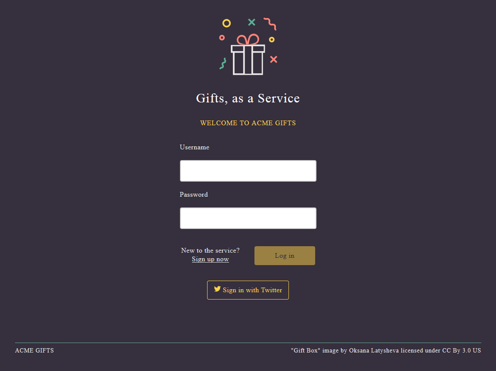

### Sign in with Twitter

Before we sign up for an account, let see sign in with Twitter. For that click on the **Sign in with twitter** button. This will bring up the Twitter sign in page.

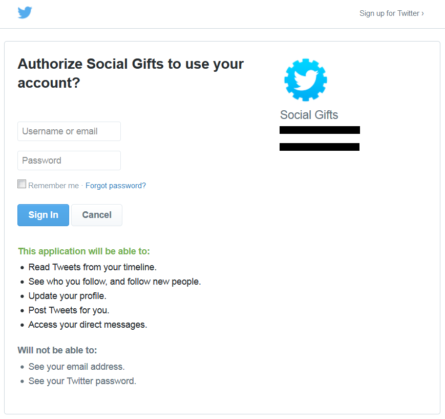

Enter your Twitter information and click **sign in**.  
After a moment, you will be routed to the main Acme Gifts groups page as seen here:

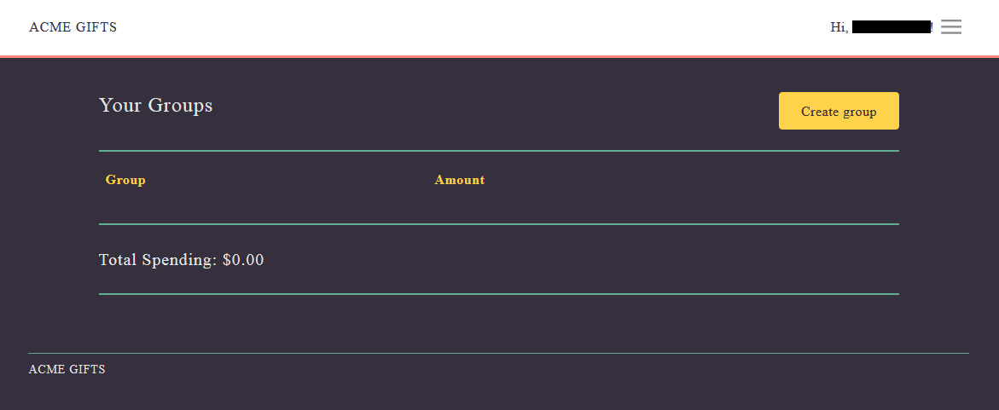

As we mentioned previously, Acme Gifts has already created a profile for you, and you are now ready to start creating groups and occasions.  
Note that you also have the option of using a username and password for authentication, but whichever way you choose when you sign up (directly or via Twitter) you will only be able to sign in that way in the future. If you would prefer to sign into Acme Gifts directly using a username and password instead of using Twitter, you will need to create an account with Acme Gifts directly. Let's do that next.

### Signup for an account

At the landing page, click on the **Sign up now** link. Enter the needed information and click on the **Create profile** button. Be sure to remember your password and username. You will use those values next to sign in to Acme Gifts. In this example, we have created a user called John Smith.

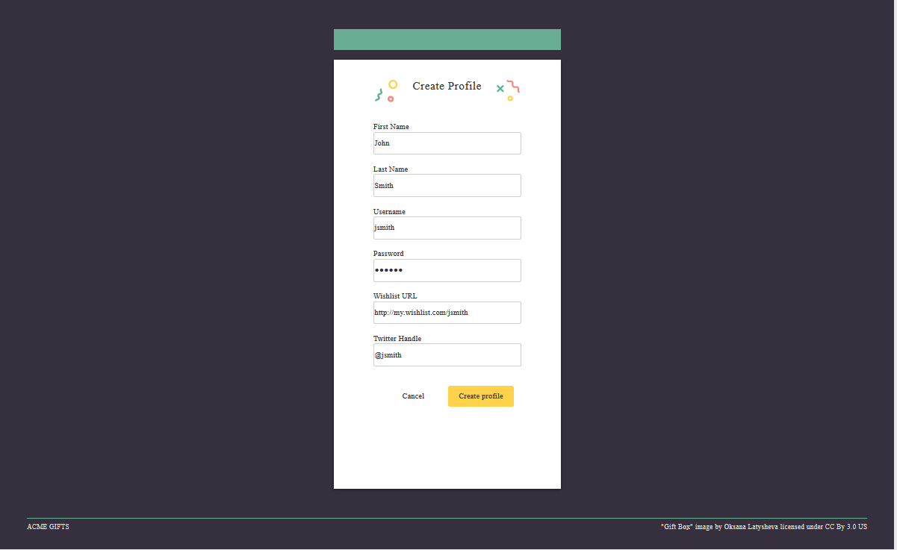

### Login

Enter your newly created username and password.

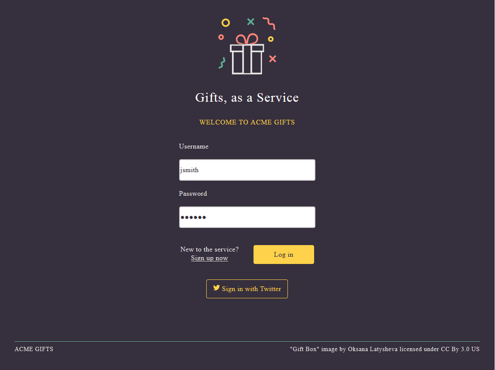

### Create a group

Now you are in the groups page. This page shows all the groups that you belong to.

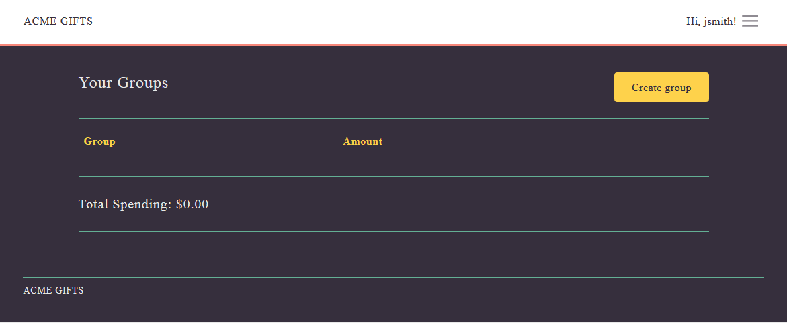
   
Let's create a couple of groups. A Co-workers and a Friends group. We have already created the Co-workers group. Here we show how to create the Friends Group. Click on the **Create group** button. This will take you to the page below:

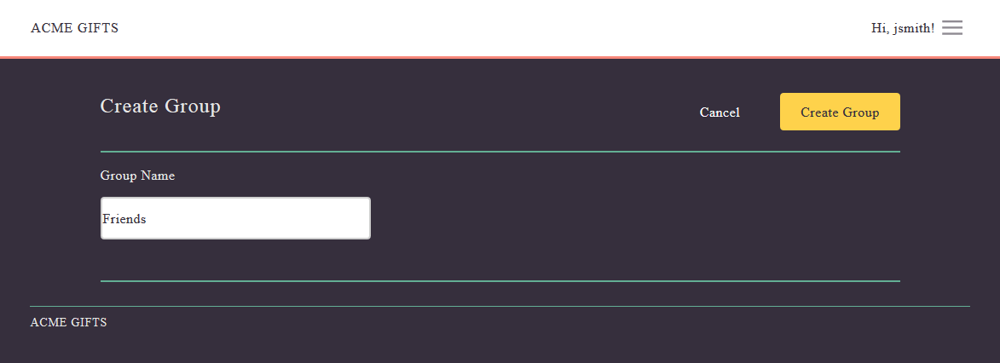

Enter the group name and click on the **Create group** button. You will be routed to the main groups page, which shows the Co-workers and Friends groups:

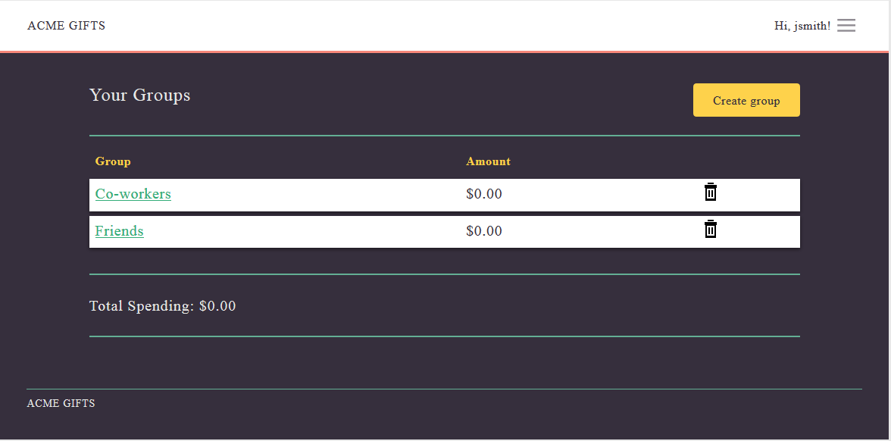

Note the amounts next to each group. They show the amount of money that you have contributed toward occasions that you created under those groups. Right now the amounts are zero because we have not created any occasions yet. The total spending at the bottom represents your overall contribution to all groups. Let's click on the Co-workers group to add members and create occasions.

### Add members to the group

You are now in the Co-workers group page.  
There are no occasions yet, but there is a single member in the group, John. John is the creator of the group; therefore, he is automatically added as a member of the group.

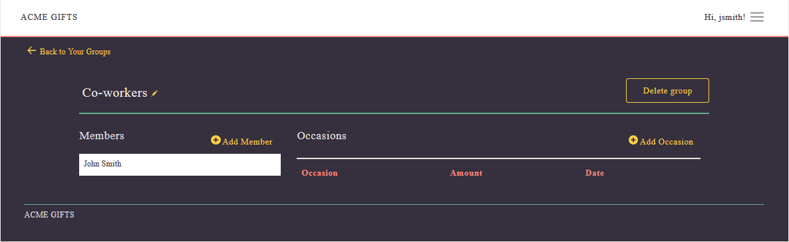

Let's add new members to this group. To do so, click on **Add Member**. This takes you to the Add member page.

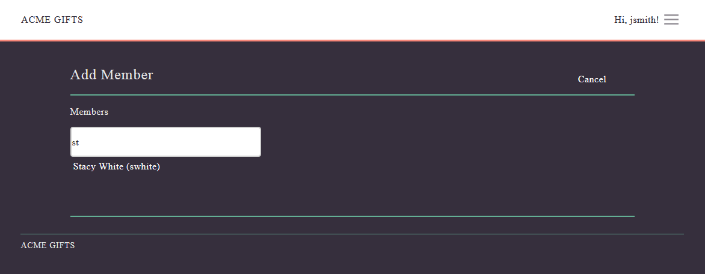 

To add members, all you need to do is search for the person using person's name, last name, or username.  
We have already added Fred. Let's add Stacy to the group. Once we find Stacy using the search box, we click on her name. She will be automatically added as a member of the Co-workers group, and we will be back in the Co-workers group page. We will create an occasion next. Click on **Add Occasion**.  

### Create an occasion

Enter the name of the occasion, the date you want it to take place, the amount you want to contribute, and choose the recipient. The recipient is chosen from the members that were added to the group. Once you are done entering the information click on the **Create occasion** button.

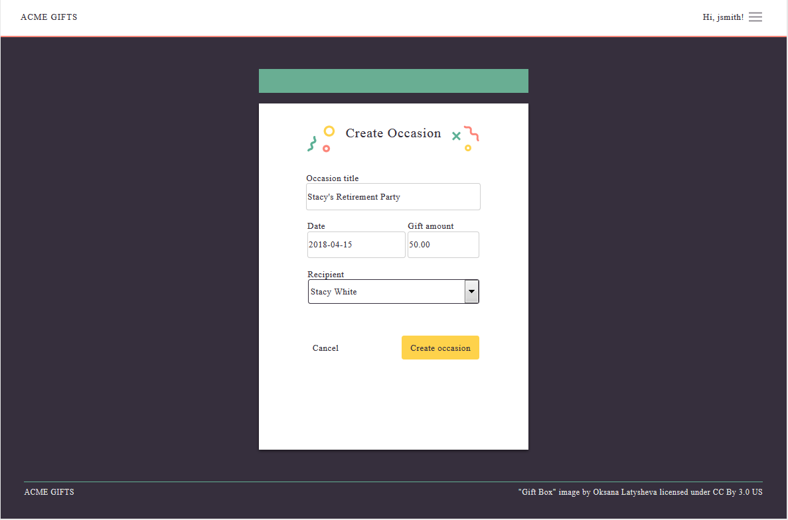 

Now let's assume, that someone within your group created an occasion for which you are the recipient. This occasion will show in your occasions page, but no contribution amount will show. You can only see your own contribution amounts and not the amount that others contribute to you.  
In this example, Linda, a member of the Co-workers group, created an occasion for John's birthday. This is how the group page looks now that we have added members and occasions:

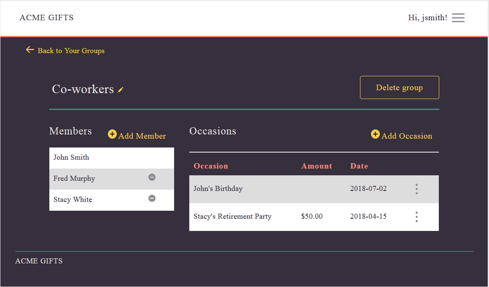  

We are done!  
Now the system will automatically track the occasion date and will automatically send a notification on the day of the event. Note that this application only does occasion notifications for now.

### Occasion execution

If microservice-notification is up and running, the event will simply be logged for administrative purposes. 
The log entry would look something like this:

    Apr 15, xxxx x:xx:xx AM net.wasdev.sample.microprofile.notification.NotificationResource
    INFO: Congratulations Stacy White! $100.00 has been contributed by Co-workers for Stacy's
    Retirement Party.  Please select a gift from your wish list at http://my.wishlist.com/swhite.

For visual purposes, you will see a notification on the screen. It will look like this:

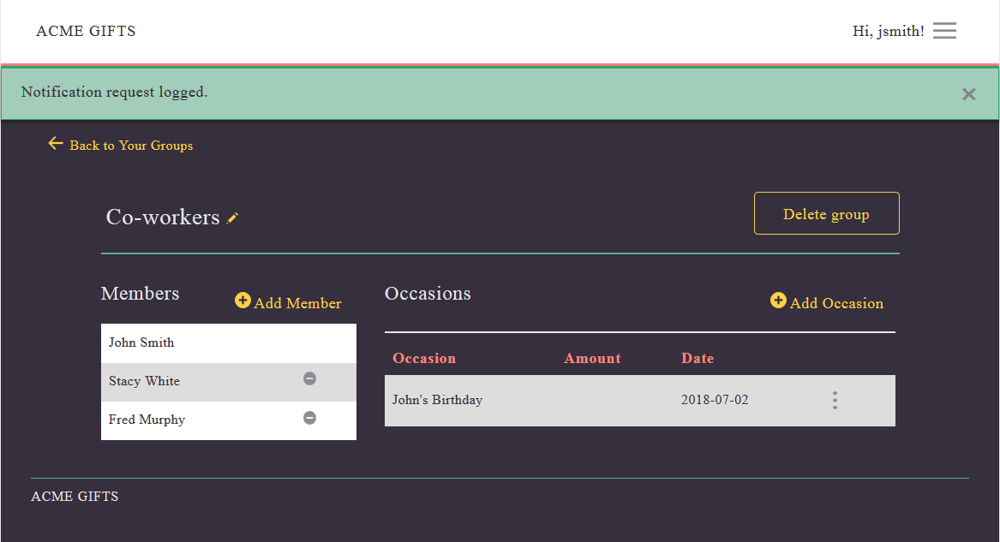
 
Notice that the occasion has now disappeared from the page.  

Now, using microprofile's Fault Tolerance, we can fallback to using another notification service.  
We realize that notification service v1 does not really send notifications to recipients, so we have upgraded it to do so. V1_1 not only logs to a file as v1 did, but it will tweet to the Acme Gifts account that a notification was sent, and it will send direct message notifications to occasion recipients that specified a twitter handle in their profile.  
Next, we will take down notification service v1, and we will start notification service v1.1 to test it without causing service interruptions. For that, we use microprofile's fault tolerance function. In particular we use the retry policy and fallback support.

Back with our example, If you remember, John created an occasion for Stacy's retirement party. If this occasion now runs, while notification service v1_1 active and notification service v1 is down, the group page shows that a tweet was sent: 

Now, let's look at the Acme Gift's Twitter page. This is the Twitter account acting on behalf of Acme Gifts.  

Here you see that a tweet was sent.

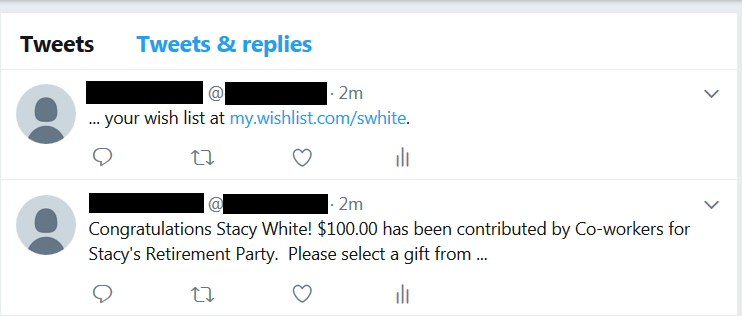

Acme Gifts also sent a direct message to the recipient who is following Acme Gifts:

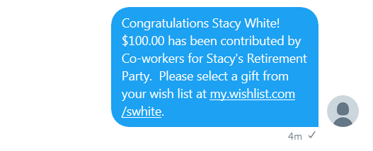

The recipient, in turn, got the tweet from Acme Gifts:

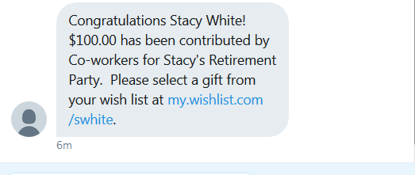

We are done!

### Optional Actions

In the group page you can click on the overflow menu icon next to each occasion. There you will have 3 options that allow you to delete any occasion, edit any occasion, or run any occasion immediately.

If you click on the menu icon at the top of the page and next to the username, you will see two options, which will allow you to logout and edit your profile.

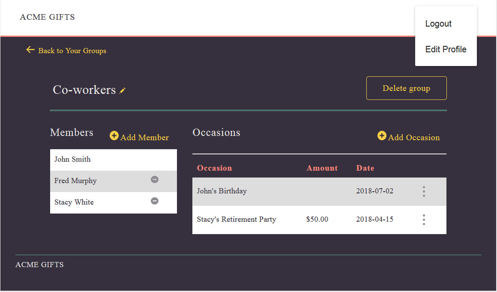
