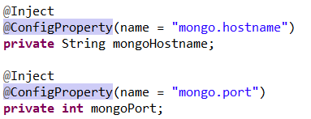
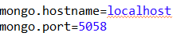
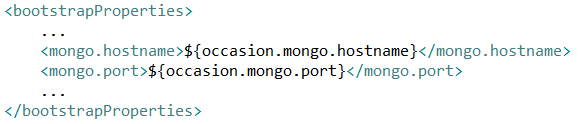
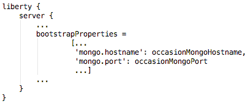
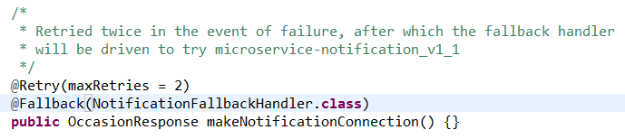
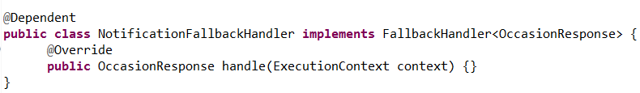
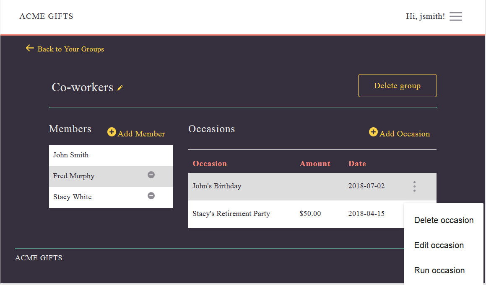
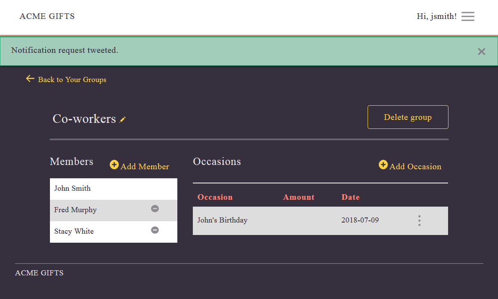

# Occasion Microservice

The occasion microservice manages the lifecycle and orchestration of occasions within the Acme Gifts application. It uses the following MicroProfile features: Config 1.1, Fault Tolerance 1.0, and JWT 1.0.   

One component at the heart of this microservice is the the Orchestrator artifact, which schedules an occasion and processes it on the specified date. It relies on internal communication with other microservices such as the group, user, and notification microservices to retrieve pertinent information and notify the recipient of the occasion at 8:00AM on the specified date.

For commands to build the occasion microservice, start the database and start the OccasionsServer see [Occasion Microservice](../README.md).
    
## Using MicroProfile config

The Acme Gifts occasion microservice uses the mpConfig-1.1 feature to obtain the configuration information that it needs to perform its actions. An example of an artifact that uses the microprofile config support can be found in `net.wasdev.samples.microProfile.occasions.MongoAccess:`

  

The configuration property value of `mongo.hostname` and `mongo.port` are defined in the bootstrap.properties file of the server running the occasion microservice:

  

The Liberty server's bootstrap.properties file, in turn, is populated by what is specified under the bootstrapProperties section of the microservice-occasion's pom.xml:  

   

In Gradle, a bootstrap.properties file is neither generated nor used. Instead, define your bootstrapProperties in the server section of your Liberty configuration in your `build.gradle` file:

## Using Microprofile Fault Tolerance

The Acme Gifts occasion microservice uses the mpFaultTolerance-1.0 feature to retry the base notification microservice version 1 before it falls back to using the notification microservice version 1.1. This is accomplished by specifying the `@Retry` and `@Fallback` annotations on the method handling the action that needs to be retried. An example can be found in  `net.wasdev.samples.microProfile.occasions.NotificationRetryBean:`

The example shows that the attempt to contact the base notification microservice should be tried twice after the original connection attempt. If the second retry fails, the artifact falls back to using the improved version of the base notification microservice. The @Fallback(NotificationFallbackHandler.class) annotation identifies the class that handles the fallback: 

   

The example identifies `net.wasdev.samples.microProfile.occasions.NotificationFallbackHandler` to be the fallback class that contacts notification microservice version 1.1. It implements `org.eclipse.microprofile.faulttolerance.FallbackHandler`. The MicroProfile fault tolerance support calls the `handle(...)` method implementation after the 2 configured retries failed. The `handle(...)` method contains the implementation that contacts notification microservice version 1.1.

### Triggering A Fallback To Notification Microservice Version 1.1

As you may have observed, the base notification microservice does not really send notifications to recipients. It is just an administrative logger. Therefore, to illustrate the fallback mechanism, we have created a notification microservice version 1.1 that not only logs notifications for administrative purposes, but also sends direct twitter messages to those recipients that specify a twitter handle in their profile and follow the Acme Gifts twitter account.

Before causing a fallback, ensure that you followed the [Getting Started](../README.md) and [Twitter Configuration](../README.md) instructions to setup your environment and start the servers. Once the setup is complete, do the following:

* Login to Acme Gifts, create a group, and create an occasion as described under [Using Acme Gifts](../front-end-ui/README.md).

* Stop the base notification microservice version 1 by issuing the following command from within the sample-acmegifts/microservice-notification directory. 
  
     `mvn liberty:stop-server` or `gradle libertyStop`
   
* On the group page, click the occasion's overflow menu icon which will bring you to the following page:

    
    
* Click **Run occasion** to cause the occasion to run now. If the request is tweeted successfully, the group page will then show a success message:
  
  

### Override occasion microservice fault tolerance maxRetries

The maxRetries value of 2 can be overridden by placing the following in the `bootstrap.properties` file of the server running the occasion microservice.
 
`net.wasdev.samples.microProfile.occasions.NotificationRetryBean/makeNotificationConnection/Retry/maxRetries=6`

